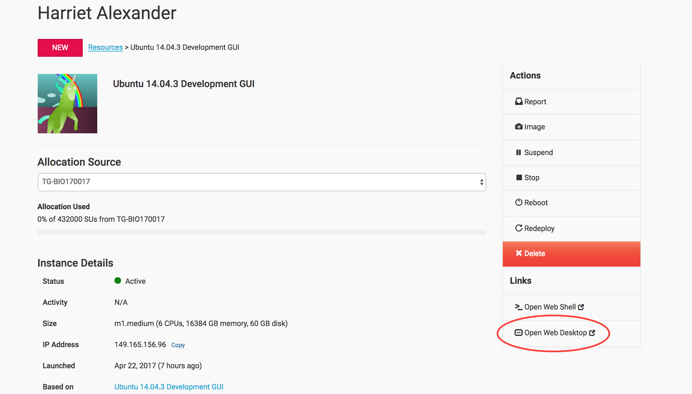
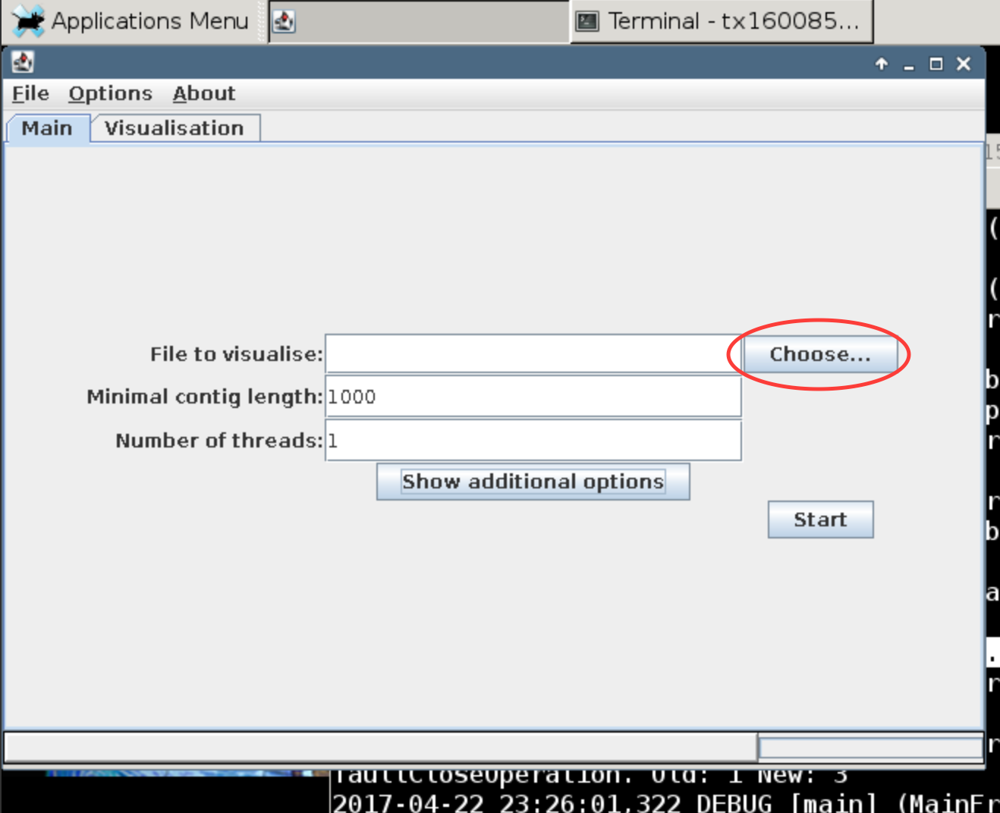
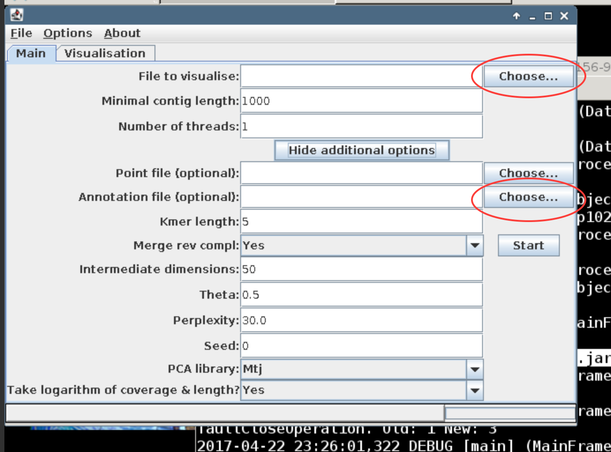

# Mapping and Binning a Metagenome Assembly

A common approach following metagenome assembly is binning, a process by which assembled contigs are collected into groups or 'bins' that might then be assigned some taxonomic affiliation. There are many different tools that can be used for binning (see [CAMI review for more details](http://biorxiv.org/content/early/2017/01/09/099127)). Here, we will be using [MaxBin](https://microbiomejournal.biomedcentral.com/articles/10.1186/2049-2618-2-26) and [MetaBAT](https://bitbucket.org/berkeleylab/metabat), which are both user friendly and highly cited. To use these binners, we will first need to map our data against the assembled metagenome using bwa and then estimate relative abundances by contig. We will then inspect the bins generated by MaxBin and MetaBAT using VizBin.


### Mapping


Download bwa:

```
cd
curl -L https://sourceforge.net/projects/bio-bwa/files/bwa-0.7.15.tar.bz2/download > bwa-0.7.15.tar.bz2
```
Unpack and build it:
```
tar xjvf bwa-0.7.15.tar.bz2
cd bwa-0.7.15
make
```
Install it:
```
sudo cp bwa /usr/local/bin
```
### Downloading data

Now, go to a new directory and grab the data::
```
mkdir ~/mapping
cd ~/mapping

curl -O https://s3-us-west-1.amazonaws.com/dib-training.ucdavis.edu/metagenomics-scripps-2016-10-12/SRR1976948.abundtrim.subset.pe.fq.gz
curl -O https://s3-us-west-1.amazonaws.com/dib-training.ucdavis.edu/metagenomics-scripps-2016-10-12/SRR1977249.abundtrim.subset.pe.fq.gz
```
And extract the files::
```
for file in *fq.gz
  do
  gunzip $file
done
```
We will also need the assembly; rather than rebuilding it, you can download a copy that we saved for you::
```
curl -O https://s3-us-west-1.amazonaws.com/dib-training.ucdavis.edu/metagenomics-scripps-2016-10-12/subset_assembly.fa.gz
gunzip subset_assembly.fa.gz
```
---
### *Optional*: look at tetramer clustering

The mapping is going to take a while, so while it's running we can look at
the tetramer nucleotide frequencies of all of our assembled contigs.  For
that, we'll need [this notebook](https://github.com/ngs-docs/2017-ucsc-metagenomics/blob/master/files/sourmash_tetramer.ipynb).

```
cd ~/
curl -O https://raw.githubusercontent.com/ngs-docs/2017-ucsc-metagenomics/master/files/sourmash_tetramer.ipynb
cd ~
```
To have this work, you will need to have the Anaconda and khmer tools from the first day installed.
First, configure it a teensy bit more securely, and also have it run in the background:
```
rm ~/.jupyter/jupyter_notebook_config.py
#jupyter notebook --generate-config #This configs a default install instead of our custom settings
```
```
cat >>~/.jupyter/jupyter_notebook_config.py <<EOF
c = get_config()
c.NotebookApp.ip = '*'
c.NotebookApp.open_browser = False
c.NotebookApp.password = u'sha1:5d813e5d59a7:b4e430cf6dbd1aad04838c6e9cf684f4d76e245c'
c.NotebookApp.port = 8000
EOF
```
### Running Jupyter Notebook 
```
jupyter notebook &
```
Once that starts running and your terminal is reading "Use Control-C to stop this server...", copy the full path generated with the command below into a new browser.
```
echo http://$(hostname):8000/  
```


****notes**:

- Pay attention as your port opens, it may say that 8000 is occupied, so change the port to the number provided in the shell.
- The password is 'davis'.
- A directory structure should open up, click on the link for the ipynb file, to start your notebook.
- Click on the notebook to start the program.
- Click inside the code boxes and hit Shift+Enter to run the code in each code box.  The results will appear below each code box.
- You should see a bunch of text and the notebook remains open until you hit Control-C


If this does not work, please follow these instructions from the first day to install jupyter notebooks:
```
sudo apt-get -y update && \
sudo apt-get install -y python3.5-dev python3.5-venv make \
    libc6-dev g++ zlib1g-dev
```
this installs Python 3.5.

Now, create a local software install and populate it with Jupyter and other dependencies::
```
python3.5 -m venv ~/py3
. ~/py3/bin/activate
pip install -U pip
pip install -U Cython
pip install -U jupyter jupyter_client ipython pandas matplotlib scipy scikit-learn khmer

pip install -U https://github.com/dib-lab/sourmash/archive/master.zip
```
Then update your environment and install khmer
```
 pip install -U setuptools
 pip install -U pip
 pip install -U Cython
 pip install https://github.com/dib-lab/khmer/archive/master.zip
```
```
cat >>~/.jupyter/jupyter_notebook_config.py <<EOF
c = get_config()
c.NotebookApp.ip = '*'
c.NotebookApp.open_browser = False
c.NotebookApp.password = u'sha1:5d813e5d59a7:b4e430cf6dbd1aad04838c6e9cf684f4d76e245c'
c.NotebookApp.port = 8000
EOF
```
Now you should be able to run as above (start at "Running Jupyter Notebook")

---

...back to mapping!

## Mapping the reads
```
cd ~/mapping
```
First, we will need to to index the megahit assembly
```
bwa index subset_assembly.fa
```
Now, we can map the reads
```
for i in *fq
  do
      bwa mem -p subset_assembly.fa $i > ${i}.aln.sam
  done
```
Converting to BAM to quickly quantify

First, index the assembly for samtools
```
samtools faidx subset_assembly.fa
```
Then, convert both SAM files to BAM files
```
for i in *.sam
  do
    samtools import subset_assembly.fa $i $i.bam
    samtools sort $i.bam $i.bam.sorted
    samtools index $i.bam.sorted.bam
  done
```
Now we can quickly get a rough count of the total number of reads mapping to each contig using samtools
```
for i in *sorted.bam
  do
    samtools idxstats $i > $i.idxstats
    cut -f1,3 $i.idxstats > $i.counts
  done
```

# Binning the Assembly
First, install MaxBin
```
 cd
 curl  https://downloads.jbei.org/data/microbial_communities/MaxBin/getfile.php?MaxBin-2.2.2.tar.gz > MaxBin-2.2.2.tar.gz
 tar xzvf MaxBin-2.2.2.tar.gz
 cd MaxBin-2.2.2
 cd src
 make
 cd ..
 ./autobuild_auxiliary
 export PATH=$PATH:~/MaxBin-2.2.2
```
Then, install MetaBAT
```
cd 
curl -L https://bitbucket.org/berkeleylab/metabat/downloads/metabat-static-binary-linux-x64_v0.32.4.tar.gz > metabatv0.32.4.tar.gz
tar xvf metabatv0.32.4.tar.gz
```
Time to finally run the Binners! 
**Note**: MaxBin can take a lot of time to run and bin your metagenome. As this is a workshop, we are doing three things that sacrifice *quality* for *speed*.

1. We are only using 2 of the 6 datasets that were generated for the
 this project. Most binning software, rely upon
 many samples to accurately bin data. And, we have subsampled the
 data to make it faster to proess.

2. We did quick and dirty contig estimation using samtools. If you use MaxBin, I would recommend allowing them to generate the abudance tables using Bowtie2. But, again, this will add to the run time.

3. We are limiting the number of iterations that are performed through
 the MaxBin expectation-maximization algorithm (5 iterations instead of
 50+). This will likely limit the quality of the bins we get
 out. So, users beware and read [the user's manual](https://downloads.jbei.org/data/microbial_communities/MaxBin/README.txt)
 before proceeding with your own data analysis.

### Binning 1 - MaxBin
--
MetaBAT uses read coverage for each contig. 

First, we will get a list of the count files that we have to pass to MaxBin
```
mkdir ~/mapping/binning
cd ~/mapping/binning
ls ../*counts > abundance.list
```
Now, on to the actual binning
```
run_MaxBin.pl -contig ../subset_assembly.fa -abund_list abundance.list -max_iteration 5 -out mbin
```
This will generate a series of files. Take a look at the files generated. In particular you should see a series of *.fasta files preceeded by numbers. These are the different genome bins predicted by MaxBin.

Take a look at the mbin.summary file. What is shown?

Now, we are going to generate a concatenated file that contains all of our genome bins put together. We will change the fasta header name to include the bin number so that we can tell them apart later. 
```
for file in mbin.*.fasta
  do 
    num=${file//[!0-9]/}
    sed -e "/^>/ s/$/ ${num}/" mbin.$num.fasta >> megahit_binned.concat.fasta
  done
```
And finally make an annotation file for visualization
```
echo label > megahit_annotation.list
grep ">" binned.concat.fasta |cut -f2 -d ' '>> megahit_annotation.list
```  
### Binning 2 - MetaBAT
--
MetaBAT uses read coverage as well as **coverage variance** for each contig. This is done with a custom script
```
~/metabat/jgi_summarize_bam_contig_depths --outputDepth depth_var.txt *sorted.bam
```
Setup another "binning" directory for this tool's results
```
mkdir ~/mapping/binning_metabat
cd ~/mapping/binning_metabat
```
Run MetaBAT script

*Note that we are outputting info to a logfile*
```
~/metabat/metabat -i ../subset_assembly.fa -a ../depth_var.txt --verysensitive -o metabat -v > log.txt
```
Make the .fasta file of all binned sequences
```
for file in metabat.*.fa
  do
    num=${file//[!0-9]/} 
   sed -e "/^>/ s/$/ ${num}/" metabat.$num.fa >> metabat_binned.concat.fasta
done 
```
Make an annotation file of the bin numbers for annotation in VizBin
```
echo label > metabat_annotation.list
grep ">" metabat_binned.concat.fasta |cut -f2 -d ' '>> metabat_annotation.list
```

## Visualizing the bins

Now that we have our binned data there are several different things we can do. One thing we might want to do is check the quality of the binning-- a useful tool for this is CheckM. We can also visualize the bins that we just generated using VizBin.

First, install VizBin::
``
cd
sudo apt-get install libatlas3-base libopenblas-base
curl -L https://github.com/claczny/VizBin/blob/master/VizBin-dist.jar?raw=true > VizBin-dist.jar
``
VizBin can run in OSX or Linux but is very hard to install on Windows. To simplify things we are going to run VizBin in the desktop emulator through JetStream (which is ... a bit clunky). So, go back to the Jetstream and open up the web desktop simulator. 



Open the terminal through the desktop simulator and open VizBin:
```
java -jar VizBin-dist.jar
```
This should prompt VizBin to open in another window. Click the choose button to open file browser to navigate to the binning folder (~/mapping/binning). There you will find the concatenated binned fasta file (binned.concat.fasta). Upload this file and hit run. 



What do you see? Read up a bit on `VizBin <https://microbiomejournal.biomedcentral.com/articles/10.1186/s40168-014-0066-1>`__ to see how the visualization is generated. 

Now, upload the annotation.list file as an annotation file to VizBin. The annotation file contains the bin id for each of the contigs in the assembly that were binned. 



Compare the results of the two binning methods-
- How many bins were found?
- How distinct are the bins?

Next we will [search and compare our data](https://2017-ucsc-metagenomics.readthedocs.io/en/latest/sourmash.html).
